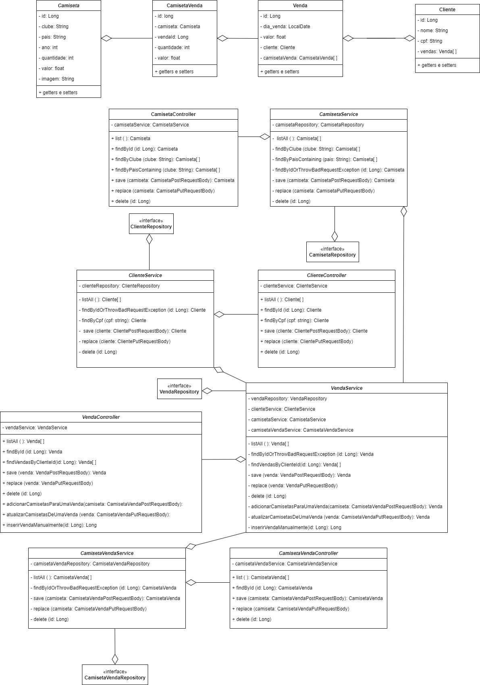

# Angular Loja de Camisas de Futebol
Front-end desenvolvido com o framework Angular de uma loja de camisas de futebol!  
Esta aplicação complementa uma API construída em Java com Spring Boot que está em outro repositório do perfil: [clique aqui!](https://github.com/YuriKevin/SpringBoot_Loja_de_Camisetas)  

## Funcionamento do sistema: 
[Assista ao vídeo](https://youtu.be/EZUzDujXRBU)

## O que este front-end faz?
- Possui uma interface apenas para usuários onde as camisas são carregadas e as compras efetuadas;
- Possui uma outra interface dedicada ao gerenciamento da loja, onde os dados das camisas, clientes e vendas efetuadas estão disponíveis para serem manipulados;
- Possui design responsivo para mobile ou desktop;
- Realiza um CRUD completo com o servidor, podendo enviar solicitações para: deletar, inserir, atualizar ou requisitar informações;
- Transforma as imagens dos usuários em strings na base 64 para salvar no servidor;
- Usa recursos importantes do framework Angular, como: manipulação de rotas, separação de módulos, uso de Observable, uso de diretivas estruturais, reutilização de componentes do core (que são utilizados em todo o sistema, como header e footer), importação de bilbiotecas como "HTTP" e "Router", entre outras coisas.

## Como utilizar?
Para utilizar esta aplicação, execute-a na porta 4200 (padrão do angular) abrindo a pasta no terminal e executando o comando "ng serve".  
Não se esqueça de executar o back-end junto! [(back-end)](https://github.com/YuriKevin/SpringBoot_Loja_de_Camisetas)

## Diagrama de classes

### This project was generated with [Angular CLI](https://github.com/angular/angular-cli) version 16.2.1.

